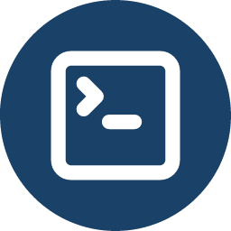

#  cv4pve-cli

```
     ______                _                      __
    / ____/___  __________(_)___ _   _____  _____/ /_
   / /   / __ \/ ___/ ___/ / __ \ | / / _ \/ ___/ __/
  / /___/ /_/ / /  (__  ) / / / / |/ /  __(__  ) /_
  \____/\____/_/  /____/_/_/ /_/|___/\___/____/\__/

Command Line Interface for Proxmox VE (Made in Italy)
```

[](LICENSE.md)
[](https://github.com/Corsinvest/cv4pve-cli/releases/latest)
[](https://github.com/Corsinvest/cv4pve-cli/releases)
[](https://winstall.app/apps/Corsinvest.cv4pve.cli)
[](https://aur.archlinux.org/packages/cv4pve-cli)

> **The whole Proxmox VE API from the command line** — what `kubectl` is to Kubernetes: saved contexts for several clusters, more than 300 built-in aliases and tab completion that reads the live cluster.
>
> **[Documentation](https://corsinvest.github.io/cv4pve-cli/)**

---

## Why

The Proxmox VE web interface is made for clicking, one object at a time. The API behind it does the same work, but calling it by hand means a login, a ticket and a `curl` line for each call. [`pvesh`](https://pve.proxmox.com/pve-docs/pvesh.1.html) is simpler, but it runs only on a node, as root, and knows only the cluster that node belongs to.

cv4pve-cli puts the whole API in a command you run from your own workstation. You save each cluster once, switch between them by name, and type `do start vm --guest web01` instead of looking up which node the guest runs on. Coming from pvesh? See [each command mapped](https://corsinvest.github.io/cv4pve-cli/coming-from-pvesh/).

It **runs outside the nodes and uses only the Proxmox VE API**: nothing to install on the cluster, no SSH. It can do exactly what the API token of its context is allowed to do.

---

## What it looks like

```
$ cv4pve-cli get vm status --guest mailstore
+--------------+------------+
| key          | value      |
+--------------+------------+
| agent        | 1          |
| cpus         | 2          |
| maxmem       | 4294967296 |
| mem          | 2030592000 |
| name         | mailstore  |
| qmpstatus    | running    |
| running-qemu | 9.2.0      |
| status       | running    |
| uptime       | 7803584    |
| vmid         | 1012       |
+--------------+------------+
```

Some of the rows. `--guest` found the node and the VM ID from the name; `-o json` gives the same data to a script.

---

## Features

- **Every API call** — `api get/set/create/delete` on any path, `api ls` and `api usage` to find what a path accepts.
- **Several clusters** — each one a saved context; switch with `config use`.
- **Aliases** — more than 300 built-in short commands (`get nodes`, `do migrate vm`, `create guest snapshot`…) plus your own.
- **Guests by name** — `--guest <name|id>` fills in node, type and VM ID.
- **Tab completion** — bash, zsh and PowerShell complete API paths, node names, VM IDs, parameters and their allowed values from the live cluster.
- **Tasks** — `task list/show/wait/log --follow/stop` to follow backups, migrations and other long operations.
- **Made for scripts** — output as text, JSON, Markdown or HTML; exit codes for `config` and `task`.
- **Self-contained binary** for Windows, Linux and macOS — no runtime to install.

---

## Quick start

```bash
# Windows
winget install Corsinvest.cv4pve.cli

# Linux (other platforms and packages: see the documentation)
wget https://github.com/Corsinvest/cv4pve-cli/releases/latest/download/cv4pve-cli-linux-x64.zip
unzip cv4pve-cli-linux-x64.zip && chmod +x cv4pve-cli

# Save the cluster once, with an API token, then run commands against it
./cv4pve-cli config add pve01 --host=pve01.local --api-token='cli@pve!cli=UUID'
./cv4pve-cli get nodes
./cv4pve-cli api get /cluster/resources --type vm -o json
```

The token and the password are saved in clear text in `~/.cv4pve/cli/config`: use a dedicated API token with only the privileges you want cv4pve-cli to have — see [Permissions](https://corsinvest.github.io/cv4pve-cli/permissions/).

---

## Documentation

| | |
|---|---|
| [Getting started](https://corsinvest.github.io/cv4pve-cli/getting-started/) | Install, first context, first commands |
| [Contexts](https://corsinvest.github.io/cv4pve-cli/contexts/) | Several clusters, token or password, certificate, where credentials are stored |
| [Permissions](https://corsinvest.github.io/cv4pve-cli/permissions/) | The user, the API token and the role to give it |
| [Coming from pvesh](https://corsinvest.github.io/cv4pve-cli/coming-from-pvesh/) | Each pvesh command and option in cv4pve-cli |
| [API calls](https://corsinvest.github.io/cv4pve-cli/api/) | `get`, `set`, `create`, `delete`, `ls`, `usage`, output formats |
| [Aliases](https://corsinvest.github.io/cv4pve-cli/aliases/) | Built-in aliases, `--guest`, your own aliases |
| [Tasks](https://corsinvest.github.io/cv4pve-cli/tasks/) | Following tasks by UPID |
| [Tab completion](https://corsinvest.github.io/cv4pve-cli/completion/) | bash, zsh, PowerShell |
| [Scripting](https://corsinvest.github.io/cv4pve-cli/scripting/) | JSON output, exit codes, CI |
| [AI coding assistants](https://corsinvest.github.io/cv4pve-cli/ai-agents/) | Claude Code, Codex, a `SKILL.md` template |
| [Reference](https://corsinvest.github.io/cv4pve-cli/reference/commands/) | Every command, every alias, every file |

---

## Related tools

Prefer PowerShell objects to text? [cv4pve-api-powershell](https://github.com/Corsinvest/cv4pve-api-powershell) gives the same API as cmdlets. For an inventory of the cluster use [cv4pve-report](https://github.com/Corsinvest/cv4pve-report), to find what is wrong [cv4pve-diag](https://github.com/Corsinvest/cv4pve-diag). The whole suite: [corsinvest.it/cv4pve](https://www.corsinvest.it/en/cv4pve/).

---

## Support

Professional support and consulting available through [Corsinvest](https://www.corsinvest.it/en/cv4pve/).

---

Part of [cv4pve](https://www.corsinvest.it/cv4pve) suite | Made with ❤️ in Italy by [Corsinvest](https://www.corsinvest.it)

Copyright © Corsinvest Srl
